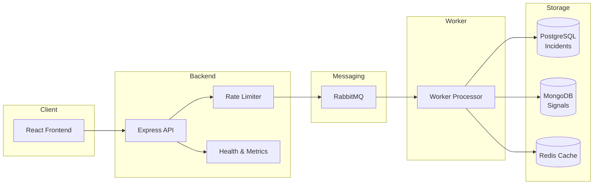

# Incident Management System (IMS)

A real-time incident management system that ingests error signals, groups them into work items, and provides a dashboard for tracking and resolving incidents with RCA (Root Cause Analysis).

## Architecture



## Tech Stack

| Layer | Technology |
|-------|-----------|
| Frontend | React 19, Vite, Tailwind CSS, Recharts |
| Backend | Node.js, Express 5 |
| Queue | RabbitMQ |
| Cache | Redis 7 |
| Databases | PostgreSQL 15 (work items, RCA), MongoDB 6 (signals) |

## Prerequisites

- [Docker](https://www.docker.com/) & Docker Compose
- [Node.js](https://nodejs.org/) (v18+)

## Setup

### 1. Start Infrastructure Services

```bash
docker-compose up -d
```

This starts:
| Service | Port |
|---------|------|
| RabbitMQ | 5672 (AMQP), 15672 (Management UI) |
| Redis | 6379 |
| MongoDB | 27017 |
| PostgreSQL | 5432 |

### 2. Backend Setup

```bash
cd backend
npm install
```

Start the API server:
```bash
npm run dev
```

Start the worker (in a separate terminal):
```bash
node src/worker.js
```

The API server runs on **http://localhost:3000**.

### 3. Frontend Setup

```bash
cd frontend
npm install
npm run dev
```

The frontend runs on **http://localhost:5173**.

## API Endpoints

| Method | Endpoint | Description |
|--------|----------|-------------|
| GET | `/health` | Health check |
| POST | `/signal` | Ingest a signal (rate-limited: 50 req/sec) |
| GET | `/work-items` | List all incidents |
| GET | `/work-items/:id` | Get incident detail with signals |
| PATCH | `/work-items/:id/status` | Update incident status |
| POST | `/work-items/:id/rca` | Submit RCA for an incident |

## Workflow

Incidents follow a strict state machine:

```
OPEN → INVESTIGATING → RESOLVED → CLOSED
```

- Incidents cannot be closed without submitting an RCA.
- MTTR (Mean Time To Resolve) is calculated on closure.
- Severity escalates automatically (P2 → P1 → P0) if higher-severity signals arrive.

## Load Testing

```bash
cd backend/src/test
node loadTest.js
```

## Note on Configuration

No `.env` files are used in this project. All database credentials, connection strings, and passwords are hardcoded directly in the service files for simplicity.
